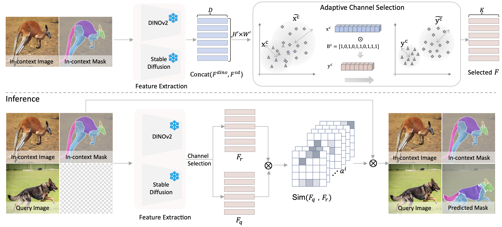

# One-shot In-context Part Segmentation

# Visual Results

# Environment Setup
conda env create -f environment.yaml

# Run demo
1. python Save_features.py
2. python Get_Select_IDs.py
3. python demo_main.py

## Acknowledgement
Our code is based on the following open-source projects: [sd-dino](https://github.com/Junyi42/sd-dino), [VLPart](https://github.com/facebookresearch/VLPart), [FBS](https://github.com/poolio/bilateral_solver). we sincerely thanks to the developers of these resources!
